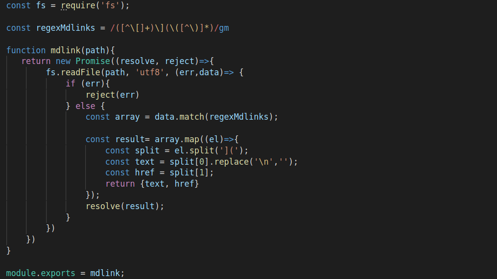

# Markdown Links
Markdown Links é uma biblioteca que lê arquivo `.md`, analisa o mesmo e retorna os links encontrados no arquivo.

## Instalação da biblioteca
Para instalar a biblioteca é necessario primeiramente ter instalado em sua maquina o NodeJS. 
Em seguida, em seu terminal insira o comando `npm install` +  https://github.com/line-chaves/SAP003-md-links

```sh
User@User:~/SeuProjeto$ npm install https://github.com/line-chaves/SAP003-md-links
```

## CLI (Command Line Interface - Interface de Linha de Comando)

A aplicação pode ser executada no terminal pela seguinte maneira: 

```sh
md-links <path-to-file> [options]
```
Por exemplo:

```sh
$ md-links ./some/example.md
http://algo.com/2/3/ Link de algo
https://outra-coisa-.net/algum-doc.html algum doc
http://google.com/ Google
```
## Como utilizar:
``` js
const mdLinks = require("md-links");

mdLinks("./example.md")
  .then(links => {
    // => [{ href, text }]
  })
  .catch(console.error);
```

## Valor de retorno:
A biblioteca retorna um promessa, que resolve um array que contêm varios objetos com o link (href) e o texto (text). 

    [
      {
        href: http://linkExemplo.com/2/3/ ,
        text: Texto de exemplo
      }
      ...
    ]

## Código.
Como se trata de um projeto back-end, segue a baixo um trecho de código que eu considero importante no projeto. 


